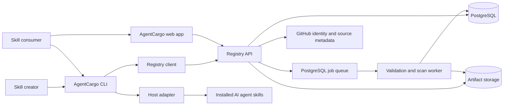
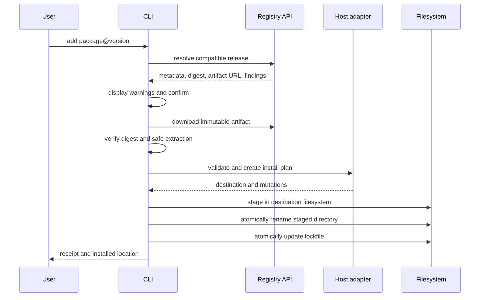
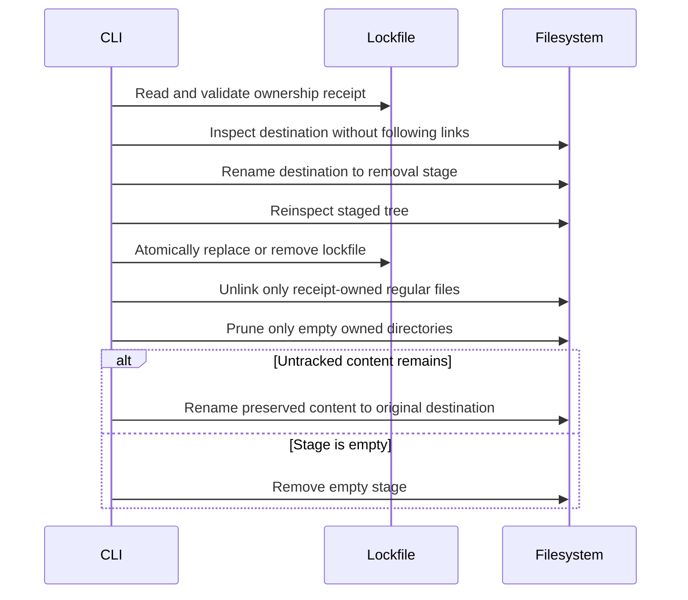
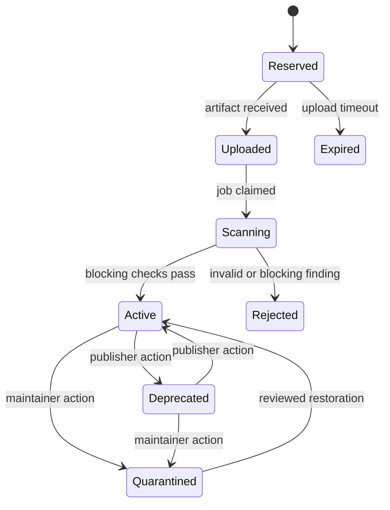

# AgentCargo Technical Architecture

## 1. Architecture summary

AgentCargo is designed as a TypeScript monorepo containing a public web application, a versioned registry API, an asynchronous scanner worker, an open-source CLI, shared package logic, and versioned host adapters.

The MVP uses a modular monolith with PostgreSQL, S3-compatible object storage, and a PostgreSQL-backed job queue. This keeps operations understandable while preserving boundaries that can be split later if usage requires it.

## 2. Design goals

- One package coordinate and command flow across supported agents.
- Deterministic, immutable, content-addressed releases.
- Safe local installation with atomic replacement and ownership tracking.
- Host-specific behavior isolated behind adapters.
- Reusable validation code shared by publisher, registry, and installer.
- Security claims tied to evidence and scanner versions.
- Infrastructure simple enough for one maintainer to operate.
- Public interfaces that can later support alternative registries.

## 3. Constraints and assumptions

- Skill packages contain untrusted text, assets, and potentially executable scripts.
- Static analysis cannot prove that natural-language instructions are safe.
- AgentCargo cannot enforce a third-party host's runtime permissions.
- Host paths and metadata formats can change independently.
- Registry availability must not be required after a skill has been installed.
- Published versions are immutable.
- The MVP does not resolve transitive skill dependencies.
- Community scripts are never executed in AgentCargo infrastructure.

## 4. System context



## 5. Recommended repository structure

```text
agentcargo/
├── apps/
│   ├── web/                  # Next.js public website and publisher UI
│   ├── api/                  # Fastify REST API
│   └── worker/               # Validation, scanning, and maintenance jobs
├── packages/
│   ├── cli/                  # Published `agentcargo` executable
│   ├── core/                 # Coordinates, manifests, validation, scanner, lockfiles
│   ├── archive/              # Deterministic packing and safe extraction
│   ├── adapter-contract/     # Stable host adapter interface
│   ├── adapter-codex/        # Codex detection and install behavior
│   ├── adapter-claude-code/  # Selected second-host adapter
│   ├── registry-contract/    # Versioned public registry read models
│   ├── registry-db/          # PostgreSQL-oriented repositories
│   ├── registry-storage/     # Digest-addressed S3-compatible object boundary
│   ├── registry-integration/ # Opt-in live registry test harness
│   ├── registry-api/         # Fastify registry routes
│   ├── registry-client/      # Typed anonymous registry client
│   ├── registry-worker/      # Leased artifact validation and activation worker
│   ├── db/                   # Schema, migrations, and repositories
│   ├── config/               # Shared lint, TypeScript, and test config
│   └── fixtures/             # Valid and malicious package fixtures
├── docs/
│   ├── PRD.md
│   ├── ARCHITECTURE.md
│   ├── ROADMAP.md
│   ├── THREAT_MODEL.md        # Created in Milestone 1
│   └── adr/                   # Architecture decision records
├── examples/
│   └── hello-skill/
├── package.json
├── pnpm-workspace.yaml
└── turbo.json
```

## 6. Technology choices

| Area | MVP choice | Reason |
| --- | --- | --- |
| Language | TypeScript | Shared types and validation across CLI, API, worker, and web. |
| Workspace | pnpm workspaces | Efficient monorepo dependency management. |
| Task orchestration | Turborepo | Simple cached builds and tests; optional if it adds friction. |
| Web | Next.js | Search pages, publisher UI, and server-rendered package pages. |
| API | Fastify | Explicit, testable REST boundary and schema-based validation. |
| CLI | Node.js TypeScript with a command framework | Fast iteration and shared core libraries. |
| Database | PostgreSQL | Transactions, full-text search, JSON metadata, and audit history. |
| Database access | Drizzle ORM or direct typed SQL | Keep migrations explicit and avoid hiding important queries. |
| Queue | PostgreSQL-backed queue | Avoid Redis during the MVP while retaining durable asynchronous jobs. |
| Artifact storage | S3-compatible object storage | Immutable archives, checksums, and CDN compatibility. |
| Authentication | GitHub OAuth for web; short-lived device/browser flow for CLI | Matches the initial creator audience. |
| API contract | OpenAPI 3.1 | Generates a CLI client and documents public registry behavior. |
| Validation | JSON Schema plus semantic validators | Machine-readable contract with clear domain errors. |
| Testing | Vitest plus platform integration jobs | Unit, property, fixture, API, and adapter coverage. |

These are starting decisions, not permanent commitments. Record deviations in architecture decision records.

## 7. Package model

### 7.1 Source layout

```text
react-review/
├── SKILL.md
├── agentcargo.yaml
├── scripts/          # Optional
├── references/       # Optional
├── assets/           # Optional
└── agents/           # Optional native host metadata
```

AgentCargo preserves native files. An adapter may add generated host metadata only in its staging directory; generated data is not silently written back into the publisher's source package.

The Codex adapter follows the official Codex skill model: a directory with a required `SKILL.md`, optional scripts, references, assets, and `agents/openai.yaml`. Project-scoped skills are installed under the repository's `.agents/skills` hierarchy and user-scoped skills under the user's `.agents/skills` directory. Because these are vendor-owned conventions, the adapter includes the documentation URL, a `2026-08-13` verification date, and compatibility tests. See the [official OpenAI documentation](https://learn.chatgpt.com/docs/build-skills).

AgentCargo vendors host-ready files for both selected hosts and both scopes. Each adapter removes registry-only `agentcargo.yaml` from its staging directory before activation; the immutable source-artifact digest and installed-file receipts remain in `agentcargo.lock`.

Claude Code is the selected second host, implemented by `@agentcargo/adapter-claude-code` version `0.1.0`. Its dedicated project and user skill roots are `<project-root>/.claude/skills` and `<user-home>/.claude/skills`. AgentCargo installs the same portable source skill without generating Claude-specific extensions and removes only the registry-only `agentcargo.yaml` from staging. The dated comparison and decision are in [ADR 0005](adr/0005-second-host-selection.md); the verified filesystem, compatibility, trust, and test contract is in [the Claude Code host contract](hosts/claude-code.md).

### 7.2 Package identity

```text
@namespace/name@version
```

Examples:

```text
@acme/react-review@1.4.2
@sarvesh/dotnet-api@0.3.0
```

Canonical identity fields:

- Namespace.
- Package name.
- Semantic version.
- Artifact SHA-256 digest.
- Source repository and immutable source commit when available.
- Manifest schema version.

### 7.3 Manifest parsing

The `agentcargo.yaml` parser must:

- Reject unknown schema versions.
- Report unknown fields as warnings before schema stability, then reject them in strict mode.
- Preserve no YAML object prototypes or custom tags.
- Treat `dependencies` as bounded descriptive runtime requirements; the MVP previews changes but does not resolve or install them.
- Limit aliases, nesting depth, scalar length, and total bytes.
- Normalize package names and reject ambiguous Unicode.
- Validate URLs and require HTTPS for remote references.
- Treat capability declarations as untrusted publisher input.

### 7.4 Deterministic artifact

Artifact format version 1 is `agentcargo-ustar-v1`: an uncompressed, canonical POSIX USTAR stream stored with the `.agentcargo` extension. `agentcargo pack` creates this representation locally, and future publishing uploads those exact bytes.

The canonical archive has:

- Lexicographically sorted UTF-8 paths.
- Normalized timestamps.
- Normalized owner/group identifiers.
- Explicit executable mode preservation only for allowed regular files.
- No absolute paths, hard links, symlinks, devices, sockets, or FIFOs.
- A maximum file count, per-file size, and expanded archive size.
- Root-relative NFC paths with `/` separators and no cross-platform-unsafe names.
- Regular files only, ordered by unsigned UTF-8 path bytes.
- Mode `0755` below `scripts/` and `0644` everywhere else.
- Zero UID, GID, modification time, device numbers, user name, and group name.
- Exactly two final zero blocks and no trailing data.

The digest is SHA-256 over the exact stored archive bytes. The same inputs must produce the same digest across supported operating systems. Full encoding, limits, and extraction invariants are recorded in [ADR 0001](adr/0001-canonical-artifact-format.md).

## 8. Host adapter contract

Host behavior must never be implemented in generic install commands. Every host implements a versioned adapter interface similar to:

The implementation and review checklist for first-party and third-party adapters is maintained in [the host adapter development guide](ADAPTERS.md).

```ts
interface HostAdapter {
  id: string;
  adapterVersion: string;

  detect(context: DetectionContext): Promise<DetectionResult>;
  supportedScopes(): InstallScope[];
  resolveDestination(input: DestinationInput): Promise<ResolvedDestination>;
  validatePackage(pkg: NormalizedPackage): Promise<AdapterFinding[]>;
  planInstall(input: InstallInput): Promise<InstallPlan>;
  applyInstall(plan: InstallPlan): Promise<InstallReceipt>;
  planRemove(input: RemoveInput): Promise<RemovePlan>;
  healthCheck(input: HealthCheckInput): Promise<HealthCheckResult>;
}
```

Adapter rules:

- Detection is read-only.
- A plan describes every filesystem mutation before it occurs.
- Destination paths must resolve beneath an explicit, validated scope root.
- Adapters never invoke a host process during normal installation unless that behavior is separately designed and consented to.
- Install and removal return receipts that are persisted in the lockfile.
- Adapter tests include current host fixtures and actual host smoke tests where licensing and automation allow.
- Documentation provenance and last-verified host version are recorded.

## 9. CLI architecture

### 9.1 Internal layers

```text
Command parser
    -> use-case service
        -> registry client
        -> package verifier
        -> host adapter
        -> transactional filesystem layer
        -> lockfile repository
```

Command handlers should contain presentation logic only. Core use cases must be callable from tests without starting a subprocess.

### 9.2 Installation transaction



Failure requirements:

- No active destination is modified until artifact verification and adapter validation finish.
- Staging occurs on the same filesystem as the final destination so rename can be atomic.
- Replacing an existing version first creates a recoverable backup or uses a rename sequence that permits rollback.
- Lockfile writes use a temporary sibling file, flush, and atomic rename.
- Interrupted operations are reported by `agentcargo doctor`; Milestone 1 does not delete or repair them automatically.

### 9.2.1 Inspection and removal transaction

`agentcargo list` treats the lockfile and installed tree as untrusted. It constrains every recorded destination beneath the adapter's skill root, refuses to follow links, and recomputes each owned file's SHA-256 digest, byte count, and canonical mode. Installations are classified as `clean`, `modified`, `missing`, or `invalid`, with missing, modified, untracked, and invalid paths reported separately.

Removal is serialized with installation by the scope's exclusive `.agentcargo-operation.lock`. The CLI requires `--yes` for every removal. Local drift additionally requires `--force`; force never permits linked or special paths and never expands ownership beyond the lockfile receipt.

Update preview is read-only. The core validates and deterministically packs the target, verifies an expected registry digest when present, extracts it into temporary storage, applies the selected adapter's staging transformation, and compares that host-ready inventory with the installed lockfile receipt. Declared capability and descriptive dependency changes remain separate from versioned scanner-finding changes. Registry lock entries use `@namespace/name` identity so the CLI can retrieve both installed and target release metadata without embedding registry URLs or credentials in the lockfile.

Applying an update holds the same scope operation lock used by installation and removal. The current receipt is reinspected immediately before mutation and must be clean. The verified target is staged beneath the host skills root, the active directory is renamed to a unique retained backup, and the staged directory is atomically renamed into place. AgentCargo then atomically replaces lockfile v1 and writes a size-limited, schema-validated `.agentcargo-rollback.json` sidecar containing the previous and current receipts plus the contained backup path. A failure while committing either metadata boundary restores the old directory and lockfile. A later rollback validates both the active and backup receipts, swaps them with same-filesystem renames, atomically restores the previous lock entry, and reverses the rollback record so the rollback itself can be undone. No package script is executed in any phase.

`agentcargo audit` is read-only. It recomputes host-ready file receipts without following links, reports missing, modified, untracked, and invalid paths separately, inspects operation/rollback recovery evidence, and runs the versioned static scanner directly over a safely inventoried installed tree without requiring the registry-only manifest. The report labels the immutable source artifact digest as recorded rather than locally reverified because canonical source artifact bytes are not retained after installation; installed receipt integrity is independently classified as verified, mismatched, or unavailable. Every drift, integrity, path, recovery, and scanner observation includes an actionable remediation.



If lockfile commit fails, the staged directory is renamed back before the operation lock is released. If interruption occurs after lockfile commit, `doctor` reports the abandoned removal stage for manual inspection. This ordering favors protecting unmanaged content over automatic cleanup.

### 9.3 Safe extraction

Before writing a file, the archive layer must:

- Reject absolute, drive-prefixed, UNC, and traversal paths.
- Normalize separators for the current platform.
- Resolve the candidate path and prove it remains below the staging root.
- Reject symlinks and links in MVP packages.
- Enforce expanded byte and file-count limits while streaming.
- Refuse case-insensitive path collisions on affected filesystems.
- Refuse special files and unsafe mode bits.

### 9.4 Lockfile

Project installations use `<project-root>/agentcargo.lock`. User installations use `agentcargo.lock` in AgentCargo's platform-specific data directory beneath the user home:

- macOS: `~/Library/Application Support/AgentCargo/agentcargo.lock`
- Linux: `~/.local/share/agentcargo/agentcargo.lock`
- Windows: `%USERPROFILE%/AppData/Local/AgentCargo/agentcargo.lock`

The lockfile records:

```yaml
lockfile_version: 1
packages:
  - package: react-review
    version: "1.4.2"
    digest: "sha256:..."
    agent: codex
    adapter_version: "0.1.0"
    scope: project
    destination: ".agents/skills/react-review"
    installed_at: "2026-08-13T00:00:00.000Z"
    files_digest: "sha256:..."
    files:
      - path: SKILL.md
        digest: "sha256:..."
        bytes: 1200
        mode: 420
    source:
      type: local
```

The lockfile contains portable relative destinations, never contains credentials, and treats all parsed content as untrusted. Version 1 records the immutable source-artifact digest plus the path, content digest, byte count, and canonical mode of every AgentCargo-owned installed file. Local paths are deliberately not persisted, keeping project lockfiles portable and avoiding disclosure of user filesystem layouts. Future registry entries use scoped package coordinates and `source.type: registry`.

## 10. Registry services

The versioned public read models, authentication-session contract, authenticated publisher workspace contract, and immutable release invariants live in [`@agentcargo/registry-contract`](../packages/registry-contract/src/index.ts). Its checked-in [OpenAPI 3.1 document](../packages/registry-contract/openapi/registry-v1.json) and runtime validators cover the initial anonymous read operations, provider-to-registry session response, token-free session introspection, owner-scoped package/version history, and gated release-reservation request/response. The package is deliberately independent of HTTP, PostgreSQL, object storage, authentication providers, and CLI presentation. The boundary and exact lookup semantics are recorded in [ADR 0006](adr/0006-registry-read-path-contract.md).

The first implementation is split into [`@agentcargo/registry-contract`](../packages/registry-contract/src/index.ts), [`@agentcargo/registry-client`](../packages/registry-client/src/index.ts), [`@agentcargo/registry-db`](../packages/registry-db/src/index.ts), [`@agentcargo/registry-storage`](../packages/registry-storage/src/index.ts), [`@agentcargo/registry-api`](../packages/registry-api/src/index.ts), and [`@agentcargo/registry-worker`](../packages/registry-worker/src/index.ts). The contract package owns the versioned public and publisher-workspace models and validators. The client owns HTTP URL construction, response validation, stable transport errors, anonymous search/package/release lookups, authenticated publisher-workspace lookup, the local credential-store boundary, GitHub PKCE callback flow, and provider identity verification. The database package owns a small `pg`-compatible client surface, parameterized release/package/search and owner-scoped publisher-history queries, public-status filtering, row validation, request-scoped artifact URL creation, release reservations, upload intents, completion metadata, durable scan jobs, and the PostgreSQL session/state-store boundaries. The storage package owns digest verification, content-addressed object keys, immutable writes, signed-download delegation, and signed-upload delegation to an S3-compatible object store. The API package owns Fastify route parsing, response validation, stable error envelopes, cache headers, anonymous read routes, the read-scoped publisher-workspace route, hosted GitHub start/callback/session routes, bearer/cookie publisher resolvers, release reservation, signed upload URL issuance, upload completion into the scanning state, and the public sanitized `/v1/status` response. Status component probes are injected so deployments can connect database, object-store, worker, and moderation checks without exposing package data or raw errors. The worker package claims leased jobs, safely verifies and extracts artifacts into an isolated temporary directory, reuses core validation and static scanning, and calls activation only for matching valid packages; it never executes package files. Authentication and namespace authorization are injected as publisher-context resolvers; provider verification remains in the client adapter and session adapters issue short-lived opaque tokens while retaining only their hashes. The API does not validate GitHub OAuth tokens, own provider sessions, accept browser-selected namespace ownership, or expose SQL rows/database errors directly.

The CLI credential handoff uses [`FileRegistryCredentialStore`](../packages/registry-client/src/auth-store.ts) for explicit registry keys and [`GitHubOAuthClient`](../packages/registry-client/src/github-oauth.ts) for provider communication. The client supports PKCE authorization-request construction, GitHub device authorization, authorization-code exchange for a hosted callback, identity revalidation through `/user`, and refresh-token rotation when GitHub returns expiring credentials. `GitHubHostedOAuthFlow` binds authorization start and callback completion to one-time redirect-bound state, while `GitHubPublisherTokenVerifier` maps GitHub `/user` checks to the API's injected verifier shape. The store validates credentials, writes them atomically with `0700` parent-directory and `0600` file permissions, supports status/login/refresh/logout without printing access tokens, and never writes credentials to `agentcargo.lock`. The API's generic bearer resolver is separately composable with a GitHub verifier or hosted session verifier, and its `/v1/auth/github/start`, `/v1/auth/github/callback`, and `/v1/auth/github/session` routes perform no-store redirects/session exchange. `GET /v1/auth/session` validates an AgentCargo bearer through the injected session store and returns only expiry and scopes, never the token or publisher identity. `GET /v1/publisher/workspace` requires `publisher:read`, derives its publisher identity from that session, and returns the owned namespaces plus reserved/uploaded/scanning/public version history with no browser-supplied namespace selector. Registry sessions carry a bounded `publisher:read`/`publisher:write` claim set; the scoped cookie resolver and mutation routes enforce `publisher:write` without exposing provider credentials. The API can use the in-memory adapter for local/demo runs or `PostgresRegistrySessionStore` for durable hash-only sessions; `PostgresRegistryOAuthStateStore` provides durable one-time callback state. Upload URL issuance and completion use the `RegistryReleaseUploadRepository` boundary plus an injected artifact-storage adapter; completion records immutable metadata and returns `scanning` without exposing a public release until worker activation. Migration `0006_registry_scan_jobs.sql` adds a durable queue with leases, retries, and scan/rejection evidence, while `0007_registry_session_scopes.sql` persists bounded session claims. Before authenticated local publication mutates the registry, the CLI exchanges its stored GitHub credential for a non-persisted, short-lived AgentCargo session requesting exactly `publisher:write`; expired or differently scoped sessions fail closed, and the provider token is never sent to release mutation endpoints. The local web app now also exposes an intent-only `POST /api/publisher-publication` route: it accepts bounded name/version/idempotency input, derives a unique namespace from the read-scoped owner workspace, exchanges a one-shot write-only session in memory, and reserves the release with no-store/no-token output. It never accepts browser package files or a namespace selector; upload, scan, activation, and release mutation authorization remain on the registry/CLI boundary.

### 10.1 Web application

Responsibilities:

- Server-rendered public search and package pages.
- Local-only instruction-skill builder that generates reviewable `SKILL.md` and `agentcargo.yaml` drafts plus a CLI handoff; it never uploads files or installs them directly.
- Authenticated read-only publisher workspace with an identity-header sign-in gate and registry-backed owner-scoped namespace/package/version histories; identity headers alone never grant namespace authorization or registry mutation rights.
- Authenticated publication intent handoff that accepts only skill name/version/idempotency input, derives a unique owned namespace server-side, and reserves a reviewable release with a one-shot write-scoped registry session; browser package files are never accepted.
- Fail-closed `/api/registry-session` status route that reports anonymous or identity-only state, sanitized opaque-session status, and the exact `publisher:read` scope without accepting browser credentials or returning registry tokens.
- Server-only registry session bridge with a deployable host-provider broker adapter, exact read-scope exchange, and fail-closed environment configuration.
- GitHub sign-in and publisher settings.
- Namespace and package management.
- Scan-result presentation.
- Reporting and maintainer moderation UI.

It does not contain registry business rules that the CLI also needs; those live in API/core packages.

The web session bridge in `app/registry-session.ts` accepts a host-owned,
request-scoped provider resolver and an exchange function. The checked-in
composition in `app/registry-session-config.ts` activates only when a registry
URL, provider-broker URL, and server-only broker credential are all configured.
The trusted broker maps the host-authenticated workspace user ID to a GitHub
credential over a server-to-server request; browser headers, cookies, and bodies
are not forwarded. The web adapter requests only `publisher:read`, validates the
returned short-lived session, and stores only its opaque AgentCargo token in an
HttpOnly cookie. `GET /api/registry-session` validates that cookie through the
registry's token-free session-introspection endpoint and exposes only
active/invalid/unavailable metadata; malformed, expired, duplicate, or
over-scoped cookies fail closed. `DELETE /api/registry-session` clears the cookie
without requiring provider credentials. Missing, partial, non-HTTPS (except
loopback), or invalid deployment settings leave the bridge unset; workspace
identity headers alone are never promoted to provider credentials.

When the cookie is present, the publisher page calls the server-only workspace
resolver, which forwards only the opaque session to
`GET /v1/publisher/workspace`. The registry resolves the publisher identity and
ownership from its session store, returns bounded immutable release histories,
and never trusts a namespace or publisher identifier from the browser. The
publication intent action sends only a bounded name, semantic version, and
idempotency key to `POST /api/publisher-publication`; the server derives the
namespace from that owner-scoped workspace, requests exactly `publisher:write`
from the host broker, and uses the short-lived token only for release
reservation. The response is no-store metadata without credentials. Invalid,
expired, unavailable, over-scoped, ambiguous, or structurally invalid responses
fail closed and no demo publisher data is rendered. Artifact upload, scanning,
and activation continue through the authenticated CLI/registry workflow. The
publication route also rejects explicit cross-origin `Origin`/Fetch Metadata
headers before authentication or body parsing; same-origin browser requests are
the only mutation requests admitted at the web boundary.

### 10.2 API

Responsibilities:

- Authentication and authorization.
- Namespace and package commands.
- Release reservation and upload completion.
- Search and metadata queries.
- Signed, short-lived artifact download URLs.
- Reports, quarantine, and audit events.
- Idempotency enforcement for publishing operations.

The initial routes are implemented in `@agentcargo/registry-api` and use the `@agentcargo/registry-db` repository interface. `GET /v1/auth/github/start` begins a configured PKCE flow, `GET /v1/auth/github/callback` completes one-time state, exchanges the provider credential, and sets a Secure/HttpOnly session cookie, `POST /v1/auth/github/session` exchanges a provider-verified GitHub bearer credential for a short-lived opaque AgentCargo session, and `GET /v1/auth/session` returns only token-free expiry/scope metadata for an active AgentCargo bearer; all auth responses are `Cache-Control: no-store`. The callback and introspection route can be backed by the PostgreSQL session/state stores after applying migrations `0003_registry_auth_sessions.sql` and `0004_registry_oauth_state.sql`. `GET /v1/status` is an anonymous, short-cache response containing only the API/database/storage/worker/moderation status contract; required-boundary failures surface as `outage`, while optional control failures surface as `degraded`. `GET /v1/publisher/workspace` is a no-store authenticated read that requires `publisher:read` and uses `PostgresRegistryPublisherWorkspaceRepository` to derive namespace ownership from the resolved session identity. `GET /v1/search`, `GET /v1/packages/:namespace/:name`, and `GET /v1/packages/:namespace/:name/versions/:version` provide anonymous reads. The exact release route returns only active or deprecated releases and overlays the mutable public status while filtering quarantined rows; package/search reads require at least one non-quarantined release and an active digest-denylist exclusion. The gated `POST /v1/packages/:namespace/:name/releases` route validates a publisher context and reservation request; `POST /v1/releases/:releaseId/upload-url` creates a digest-bound signed upload URL, and `POST /v1/releases/:releaseId/complete` verifies the immutable object metadata and records completion in `scanning` state. `POST /v1/reports` accepts a bounded, idempotent authenticated report, while `GET /v1/admin/audit-events` exposes only bounded append-only events to an injected maintainer context; publisher deprecation and maintainer quarantine/restoration routes use the same guarded moderation repository, no-store responses, and idempotent transition keys. `GET /v1/security/denylist` returns only active SHA-256 entries, and `POST /v1/admin/security/denylist` provides maintainer-only idempotent add/remove mutations with bounded reasons; active entries are also checked by the scan worker before activation and by artifact resolution before signed downloads. Applying migrations `0005_registry_release_uploads.sql`, `0006_registry_scan_jobs.sql`, `0008_registry_moderation.sql`, `0009_release_moderation.sql`, and `0010_digest_denylist.sql` supplies durable upload intent, completion metadata, the worker queue, bounded report storage, append-only audit events, guarded release status transitions, and the emergency denylist. The local web app's `/api/registry-session` route is intentionally separate from the registry API, and `/api/publisher-publication` is an intent-only server boundary: it derives ownership from the read-scoped workspace, requests exactly `publisher:write` for one reservation, rejects browser namespace/files, returns no-store metadata without tokens, and leaves upload/scan/activation to the registry/CLI workflow. Both routes expose only sanitized failures and fail closed until their server-only deployment settings are configured.

Suggested route groups:

```text
GET    /v1/search
GET    /v1/packages/:namespace/:name
GET    /v1/packages/:namespace/:name/versions
GET    /v1/packages/:namespace/:name/versions/:version
GET    /v1/publisher/workspace
POST   /v1/packages
POST   /v1/packages/:namespace/:name/releases
POST   /v1/releases/:releaseId/upload-url
POST   /v1/releases/:releaseId/complete
GET    /v1/releases/:releaseId/artifact
POST   /v1/reports
POST   /v1/admin/releases/:releaseId/quarantine
GET    /v1/security/denylist
POST   /v1/admin/security/denylist
```

All mutation endpoints accept an idempotency key. Error responses include a stable code, human message, field-level details when relevant, and request ID.

Rate limiting is route-aware and injectable through `RegistryRateLimiter`. Authentication, search, reporting, publishing, and moderation paths use bounded fixed-window policies; allowed responses expose `RateLimit-Limit`, `RateLimit-Remaining`, and `RateLimit-Reset`, while rejected responses use stable `429 REGISTRY_RATE_LIMITED` errors with `Retry-After`. The default process-local limiter has a hard key bound and is appropriate for local/single-process operation. A production deployment spanning multiple instances must provide a shared limiter, and limiter failures fail closed for mutation paths with a generic `503`.

### 10.3 Worker

The worker performs:

- Artifact digest verification.
- Safe unpacking into an isolated temporary directory.
- Manifest and `SKILL.md` validation.
- File classification.
- Static scanner rules.
- Search document generation.
- Release activation or rejection.
- Scheduled cleanup of abandoned uploads.
- Periodic rescan after scanner-rule updates.

The `@agentcargo/registry-worker` implementation claims one job at a time through
`PostgresRegistryScanJobRepository`, using short leases and `FOR UPDATE SKIP LOCKED`.
It downloads bytes through an injected artifact fetcher, verifies the reserved digest,
extracts only canonical regular files, compares the extracted manifest and file inventory
with the publisher completion metadata, and persists either bounded rejection evidence or
an active release candidate through `PostgresRegistryReleaseScanRepository`. The worker
uses no credentials available to uploaded code and never executes package files.

`RegistryReleaseWorkerScheduler` provides the continuous process boundary around that
single-cycle worker. It validates a bounded interval, schedules the first claim
immediately, never overlaps cycles, and lets the active lease-owning run finish before
`stop()` returns; no new claim starts after draining begins. Worker failures and retryable
job outcomes are tracked with a consecutive-failure threshold while the loop continues
so PostgreSQL's `available_at` retry policy remains authoritative. Optional queue counters
(`queued`, `failed`, `running`, `staleLeases`, and oldest available time) are read from
`PostgresRegistryScanJobRepository` without selecting package content. The scheduler
exposes sanitized `health()` and `readiness()` snapshots with run age, dispatch lag,
duration, claim count, queue lag, and bounded failure reasons. A deployment can publish
these snapshots through its own health endpoint; neither package bytes nor credentials
are included.

Worker activation requires an injected digest-denylist reader. Both the worker
orchestrator and PostgreSQL activation repository refuse construction without
that boundary and fail before artifact download/activation if the reader is
unavailable; a denylist outage remains a retryable job failure rather than an
implicit allow.

## 11. Publication state machine



Version identity is reserved at the `Reserved` transition and cannot be reused after upload completion. A failed validation retains an auditable release record but no public artifact download.

## 12. Data model

Core tables:

### `users`

- `id`
- `github_user_id` (unique)
- `login`
- `display_name`
- `avatar_url`
- `created_at`, `updated_at`

### `namespaces`

- `id`
- `slug` (unique)
- `kind` (`personal`, future `organization`)
- `created_at`

### `namespace_members`

- `namespace_id`
- `user_id`
- `role`
- `created_at`

### `packages`

- `id`
- `namespace_id`
- `name`
- `description`
- `repository_url`
- `status`
- `created_at`, `updated_at`
- Unique: `(namespace_id, name)`

### `releases`

- `id`
- `package_id`
- `version`
- `status`
- `artifact_key`
- `artifact_digest`
- `artifact_size`
- `source_commit`
- `manifest_json`
- `published_by`
- `published_at`
- `quarantine_previous_status` (nullable `active`/`deprecated` state retained only while quarantined)
- Unique: `(package_id, version)`
- Unique: `artifact_digest` may be non-unique across packages if identical content is permitted; storage can still deduplicate by digest.

### `scan_runs`

- `id`
- `release_id`
- `scanner_version`
- `status`
- `started_at`, `completed_at`
- `summary_json`

### `findings`

- `id`
- `scan_run_id`
- `rule_id`
- `rule_version`
- `severity`
- `path`
- `evidence_json`
- `message`

### `compatibility_results`

- `id`
- `release_id`
- `host`
- `adapter_version`
- `host_version`
- `status`
- `tested_at`
- `details_json`

### `download_events_daily`

- Aggregated date, package, release, host, and count.
- Do not retain raw IP addresses for product analytics.

### `reports` and `audit_events`

- `registry_reports` contains a publisher-scoped idempotency key, category, reporter identity, package/release target, lifecycle status, bounded evidence, and timestamps.
- `registry_moderation_audit_events` is append-only at the database boundary and records actor, action, target, timestamp, request ID, and safe bounded metadata; update/delete attempts are rejected by a trigger.
- Report evidence is never copied into audit metadata, and audit reads are maintainer-authorized rather than public.

### `digest_denylist`

- `registry_digest_denylist` stores normalized `sha256:` digests, bounded reasons, active state, and add/update timestamps; the digest is the primary key and the active index keeps public checks bounded.
- Add/remove mutations are maintainer-authorized, idempotent, and append an immutable moderation event without storing credentials or package contents.
- Public release/package/search reads, signed artifact resolution, and worker activation reject active denylisted digests. Removing an entry only changes current eligibility; the audit history remains immutable.

## 13. Search architecture

Use PostgreSQL full-text search and trigram indexes for the MVP.

Ranking order:

1. Exact scoped name.
2. Exact unscoped name.
3. Prefix name match.
4. Weighted description and tags.
5. Publisher name.

Filters are applied before ranking. Active releases only are searchable by default. A future search service can consume an outbox table without changing the public API.

## 14. Trust and security model

### 14.1 Trust statements

AgentCargo reports evidence in three columns:

| Category | Source | Guarantee |
| --- | --- | --- |
| Declared | Publisher manifest | The publisher made this claim. |
| Observed | Versioned static scanner | AgentCargo detected or did not detect specified patterns. |
| Enforced | Host documentation and adapter evidence | The named host enforces the stated boundary under specified conditions. |

`No finding` must never be rendered as `safe`.

### 14.2 Initial scanner rules

- Invalid or deceptive metadata.
- Executable files and script extensions.
- Shell command patterns.
- Network URLs and dynamic download commands.
- Environment-variable references and likely secret names.
- Destructive filesystem commands.
- Encoded or minified payloads above thresholds.
- Unexpected binaries or archives.
- Nested archives.
- Very large or numerous files.
- Instructions attempting to override user or host security controls.
- References to paths outside the repository or user skill roots.

These rules create findings; only clearly invalid package structure and known-denylisted content block publication automatically in the first release. High-severity heuristic findings can require manual review rather than pretending the scanner is certain.

### 14.3 Threat boundaries

- Browser/API input is untrusted.
- OAuth identity proves control of an account, not skill safety.
- Uploaded archives are hostile.
- Object storage metadata is not trusted as verification of content.
- Scanner findings can include attacker-controlled text and must be escaped in every UI.
- Local lockfiles can be edited by users or other processes.
- Host adapters operate with the invoking user's filesystem permissions and therefore require narrow path validation.

### 14.4 Required controls

- Content Security Policy and output encoding on public package pages.
- CSRF protection for browser mutations.
- Short-lived, scoped upload and download URLs.
- Rate limits for authentication, search, publishing, and reporting.
- Artifact digest verification before and after storage.
- Safe archive extraction in registry and CLI.
- Dependency pinning and automated dependency review.
- Secret scanning on the AgentCargo repository itself.
- Structured audit logs without tokens or package file contents.
- Maintainer accounts protected with strong multi-factor authentication.
- Backups and restore exercises for registry metadata.

## 15. API and compatibility evolution

- REST routes are versioned under `/v1`.
- `agentcargo.yaml` has an independent `schema_version`.
- `agentcargo.lock` has an independent `lockfile_version`.
- Adapter contracts use semantic versions.
- Scanner rules have stable IDs and versions.
- CLI sends its version and supported manifest/lockfile versions.
- The API returns minimum supported CLI version only when a genuine protocol or security requirement exists.
- Additive API fields are allowed; clients ignore unknown response fields.
- Breaking manifest changes require a migration command and a new schema version.

## 16. Observability

Every request and job receives a correlation ID.

Minimum signals:

- API request count, latency, and error codes.
- Publish funnel by validation outcome.
- Queue age, attempts, and dead-letter count.
- Worker scheduler readiness, run age, dispatch lag, duration, claimed-job count, queue counters, stale leases, and queue lag.
- Artifact upload/download failures and digest mismatches.
- Install failures by CLI, OS, host, adapter, and stable error code.
- Quarantine propagation age.
- Authentication failures without recording secrets.

Operational alerts should focus on user-visible failure, security anomalies, and data-integrity problems rather than raw CPU thresholds alone.

## 17. Deployment topology

Initial deployment:

- One web deployment.
- One API deployment with at least two instances when public traffic begins.
- One worker process running `RegistryReleaseWorkerScheduler` with a bounded interval and graceful lease-aware shutdown; scale-out relies on PostgreSQL lease claims rather than overlapping local cycles.
- Managed PostgreSQL with point-in-time recovery.
- S3-compatible private bucket behind signed URLs or a controlled download endpoint.
- CDN for public web assets and immutable package artifacts after authorization policy is applied.

Development uses local PostgreSQL and an S3-compatible emulator or filesystem-backed test double. Production code must use the same storage interface.

## 18. Testing strategy

### Unit tests

- Coordinate parsing and normalization.
- Manifest validation.
- Semantic version resolution.
- Finding classification.
- Destination containment checks.
- Lockfile migrations.

### Property and fuzz tests

- Archive path normalization.
- Malformed YAML.
- Unicode and case-collision package names.
- Semver range resolution.
- Deterministic archive generation.

### Contract tests

- Every adapter runs against the same install/remove/rollback contract suite.
- API implementation matches OpenAPI schemas.
- CLI API client supports current and previous compatible server responses.

### Integration tests

- Publish to active release.
- Rejected release.
- Anonymous resolution and artifact download.
- Install, update, rollback, and remove.
- Interrupted operations.
- Quarantine and denylist behavior.
- Expired signed URLs and idempotent retries.

### Platform matrix

- macOS latest supported release.
- Ubuntu LTS.
- Windows latest supported release.
- Supported Node.js LTS versions.
- Codex project and user scopes.
- Claude Code project and user scopes.

## 19. Key architecture decisions

1. **Modular monolith before microservices.** Clear package boundaries provide enough separation without distributed-system overhead.
2. **Artifacts are mirrored and immutable.** A Git tag or branch can move; installation must resolve to stored bytes and a digest.
3. **Adapters own host paths.** Core code never assumes `.agents/skills` or another vendor path.
4. **No runtime execution during scanning.** Static evidence is less ambitious but much safer and cheaper for the MVP.
5. **Open contracts.** The CLI, manifest schema, lockfile schema, adapter interface, and scan rules are public and versioned.
6. **PostgreSQL search and queue initially.** Avoid Elasticsearch and Redis until measured load requires them.
7. **Evidence instead of composite scores.** Findings remain explainable, versioned, and reviewable.
8. **Vendor project skills in MVP.** AgentCargo installs real directories instead of symlinks or central-cache pointers so host discovery and filesystem ownership are explicit across operating systems.
9. **Apache-licensed public contracts.** Trust-critical client code and contracts remain open while hosted implementations may be separately deployed; see [ADR 0004](adr/0004-open-source-boundary-and-license.md).
10. **Claude Code second.** Claude Code is the second MVP host because its current adoption, standard-based skill contract, distinct project/user paths, and deterministic test surface best exercise the adapter abstraction; see [ADR 0005](adr/0005-second-host-selection.md).

## 20. Architecture questions to resolve during implementation

- GitHub OAuth device flow versus browser callback with a one-time CLI code.
- Maximum artifact, file, and expanded archive sizes.
- Registry domain, package namespace policy, and CLI npm package availability.
