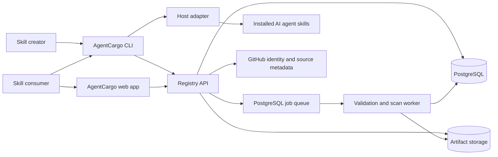
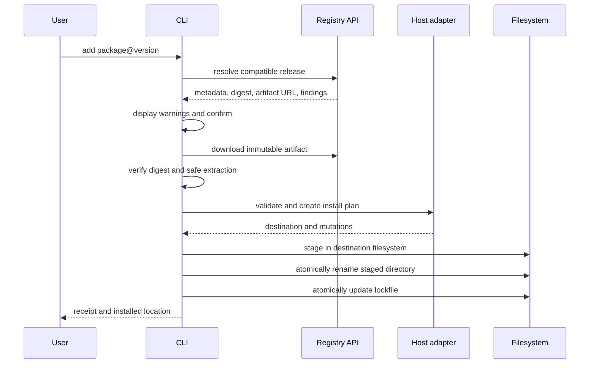
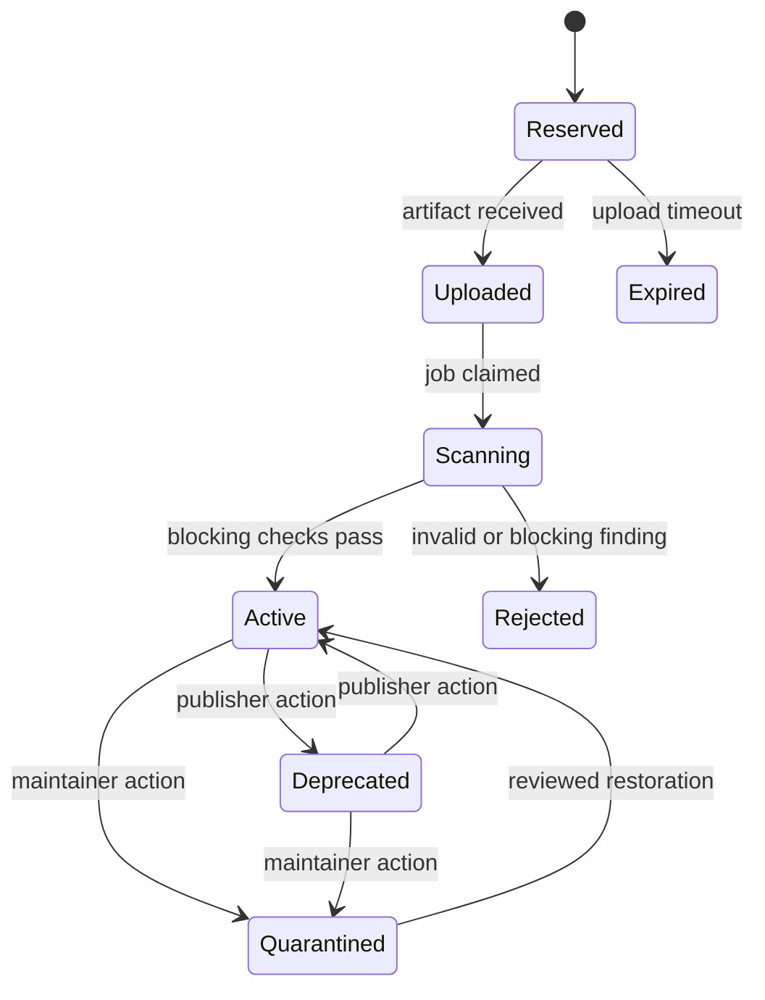

# AgentCargo Technical Architecture

## 1. Architecture summary

AgentCargo is designed as a TypeScript monorepo containing a public web application, a versioned registry API, an asynchronous scanner worker, an open-source CLI, shared package logic, and versioned host adapters.

The MVP uses a modular monolith with PostgreSQL, S3-compatible object storage, and a PostgreSQL-backed job queue. This keeps operations understandable while preserving boundaries that can be split later if usage requires it.

## 2. Design goals

- One package coordinate and command flow across supported agents.
- Deterministic, immutable, content-addressed releases.
- Safe local installation with atomic replacement and ownership tracking.
- Host-specific behavior isolated behind adapters.
- Reusable validation code shared by publisher, registry, and installer.
- Security claims tied to evidence and scanner versions.
- Infrastructure simple enough for one maintainer to operate.
- Public interfaces that can later support alternative registries.

## 3. Constraints and assumptions

- Skill packages contain untrusted text, assets, and potentially executable scripts.
- Static analysis cannot prove that natural-language instructions are safe.
- AgentCargo cannot enforce a third-party host's runtime permissions.
- Host paths and metadata formats can change independently.
- Registry availability must not be required after a skill has been installed.
- Published versions are immutable.
- The MVP does not resolve transitive skill dependencies.
- Community scripts are never executed in AgentCargo infrastructure.

## 4. System context



## 5. Recommended repository structure

```text
agentcargo/
├── apps/
│   ├── web/                  # Next.js public website and publisher UI
│   ├── api/                  # Fastify REST API
│   └── worker/               # Validation, scanning, and maintenance jobs
├── packages/
│   ├── cli/                  # Published `agentcargo` executable
│   ├── core/                 # Coordinates, semver, manifests, lockfiles
│   ├── archive/              # Deterministic packing and safe extraction
│   ├── scanner/              # Static rules and findings model
│   ├── adapter-contract/     # Stable host adapter interface
│   ├── adapter-codex/        # Codex detection and install behavior
│   ├── adapter-second-host/  # Added after host-contract validation
│   ├── api-client/           # Generated or typed registry client
│   ├── db/                   # Schema, migrations, and repositories
│   ├── config/               # Shared lint, TypeScript, and test config
│   └── fixtures/             # Valid and malicious package fixtures
├── docs/
│   ├── PRD.md
│   ├── ARCHITECTURE.md
│   ├── ROADMAP.md
│   ├── THREAT_MODEL.md        # Created in Milestone 1
│   └── adr/                   # Architecture decision records
├── examples/
│   └── hello-skill/
├── package.json
├── pnpm-workspace.yaml
└── turbo.json
```

## 6. Technology choices

| Area | MVP choice | Reason |
| --- | --- | --- |
| Language | TypeScript | Shared types and validation across CLI, API, worker, and web. |
| Workspace | pnpm workspaces | Efficient monorepo dependency management. |
| Task orchestration | Turborepo | Simple cached builds and tests; optional if it adds friction. |
| Web | Next.js | Search pages, publisher UI, and server-rendered package pages. |
| API | Fastify | Explicit, testable REST boundary and schema-based validation. |
| CLI | Node.js TypeScript with a command framework | Fast iteration and shared core libraries. |
| Database | PostgreSQL | Transactions, full-text search, JSON metadata, and audit history. |
| Database access | Drizzle ORM or direct typed SQL | Keep migrations explicit and avoid hiding important queries. |
| Queue | PostgreSQL-backed queue | Avoid Redis during the MVP while retaining durable asynchronous jobs. |
| Artifact storage | S3-compatible object storage | Immutable archives, checksums, and CDN compatibility. |
| Authentication | GitHub OAuth for web; short-lived device/browser flow for CLI | Matches the initial creator audience. |
| API contract | OpenAPI 3.1 | Generates a CLI client and documents public registry behavior. |
| Validation | JSON Schema plus semantic validators | Machine-readable contract with clear domain errors. |
| Testing | Vitest plus platform integration jobs | Unit, property, fixture, API, and adapter coverage. |

These are starting decisions, not permanent commitments. Record deviations in architecture decision records.

## 7. Package model

### 7.1 Source layout

```text
react-review/
├── SKILL.md
├── agentcargo.yaml
├── scripts/          # Optional
├── references/       # Optional
├── assets/           # Optional
└── agents/           # Optional native host metadata
```

AgentCargo preserves native files. An adapter may add generated host metadata only in its staging directory; generated data is not silently written back into the publisher's source package.

The Codex adapter follows the official Codex skill model: a directory with a required `SKILL.md`, optional scripts, references, assets, and `agents/openai.yaml`. Project-scoped skills are installed under the repository's `.agents/skills` hierarchy and user-scoped skills under the user's `.agents/skills` directory. Because these are vendor-owned conventions, the adapter includes the documentation URL, a `2026-08-13` verification date, and compatibility tests. See the [official OpenAI documentation](https://learn.chatgpt.com/docs/build-skills).

AgentCargo vendors host-ready files for both Codex scopes. The Codex adapter removes registry-only `agentcargo.yaml` from its staging directory before activation; the immutable source-artifact digest and installed-file receipts remain in `agentcargo.lock`.

### 7.2 Package identity

```text
@namespace/name@version
```

Examples:

```text
@acme/react-review@1.4.2
@sarvesh/dotnet-api@0.3.0
```

Canonical identity fields:

- Namespace.
- Package name.
- Semantic version.
- Artifact SHA-256 digest.
- Source repository and immutable source commit when available.
- Manifest schema version.

### 7.3 Manifest parsing

The `agentcargo.yaml` parser must:

- Reject unknown schema versions.
- Report unknown fields as warnings before schema stability, then reject them in strict mode.
- Preserve no YAML object prototypes or custom tags.
- Limit aliases, nesting depth, scalar length, and total bytes.
- Normalize package names and reject ambiguous Unicode.
- Validate URLs and require HTTPS for remote references.
- Treat capability declarations as untrusted publisher input.

### 7.4 Deterministic artifact

Artifact format version 1 is `agentcargo-ustar-v1`: an uncompressed, canonical POSIX USTAR stream stored with the `.agentcargo` extension. `agentcargo pack` creates this representation locally, and future publishing uploads those exact bytes.

The canonical archive has:

- Lexicographically sorted UTF-8 paths.
- Normalized timestamps.
- Normalized owner/group identifiers.
- Explicit executable mode preservation only for allowed regular files.
- No absolute paths, hard links, symlinks, devices, sockets, or FIFOs.
- A maximum file count, per-file size, and expanded archive size.
- Root-relative NFC paths with `/` separators and no cross-platform-unsafe names.
- Regular files only, ordered by unsigned UTF-8 path bytes.
- Mode `0755` below `scripts/` and `0644` everywhere else.
- Zero UID, GID, modification time, device numbers, user name, and group name.
- Exactly two final zero blocks and no trailing data.

The digest is SHA-256 over the exact stored archive bytes. The same inputs must produce the same digest across supported operating systems. Full encoding, limits, and extraction invariants are recorded in [ADR 0001](adr/0001-canonical-artifact-format.md).

## 8. Host adapter contract

Host behavior must never be implemented in generic install commands. Every host implements a versioned adapter interface similar to:

```ts
interface HostAdapter {
  id: string;
  adapterVersion: string;

  detect(context: DetectionContext): Promise<DetectionResult>;
  supportedScopes(): InstallScope[];
  resolveDestination(input: DestinationInput): Promise<ResolvedDestination>;
  validatePackage(pkg: NormalizedPackage): Promise<AdapterFinding[]>;
  planInstall(input: InstallInput): Promise<InstallPlan>;
  applyInstall(plan: InstallPlan): Promise<InstallReceipt>;
  planRemove(input: RemoveInput): Promise<RemovePlan>;
  healthCheck(input: HealthCheckInput): Promise<HealthCheckResult>;
}
```

Adapter rules:

- Detection is read-only.
- A plan describes every filesystem mutation before it occurs.
- Destination paths must resolve beneath an explicit, validated scope root.
- Adapters never invoke a host process during normal installation unless that behavior is separately designed and consented to.
- Install and removal return receipts that are persisted in the lockfile.
- Adapter tests include current host fixtures and actual host smoke tests where licensing and automation allow.
- Documentation provenance and last-verified host version are recorded.

## 9. CLI architecture

### 9.1 Internal layers

```text
Command parser
    -> use-case service
        -> registry client
        -> package verifier
        -> host adapter
        -> transactional filesystem layer
        -> lockfile repository
```

Command handlers should contain presentation logic only. Core use cases must be callable from tests without starting a subprocess.

### 9.2 Installation transaction



Failure requirements:

- No active destination is modified until artifact verification and adapter validation finish.
- Staging occurs on the same filesystem as the final destination so rename can be atomic.
- Replacing an existing version first creates a recoverable backup or uses a rename sequence that permits rollback.
- Lockfile writes use a temporary sibling file, flush, and atomic rename.
- Interrupted operations are detected and recovered by `agentcargo doctor`.

### 9.3 Safe extraction

Before writing a file, the archive layer must:

- Reject absolute, drive-prefixed, UNC, and traversal paths.
- Normalize separators for the current platform.
- Resolve the candidate path and prove it remains below the staging root.
- Reject symlinks and links in MVP packages.
- Enforce expanded byte and file-count limits while streaming.
- Refuse case-insensitive path collisions on affected filesystems.
- Refuse special files and unsafe mode bits.

### 9.4 Lockfile

Project installations use `<project-root>/agentcargo.lock`. User installations use `agentcargo.lock` in AgentCargo's platform-specific data directory beneath the user home:

- macOS: `~/Library/Application Support/AgentCargo/agentcargo.lock`
- Linux: `~/.local/share/agentcargo/agentcargo.lock`
- Windows: `%USERPROFILE%/AppData/Local/AgentCargo/agentcargo.lock`

The lockfile records:

```yaml
lockfile_version: 1
packages:
  - package: react-review
    version: "1.4.2"
    digest: "sha256:..."
    agent: codex
    adapter_version: "0.1.0"
    scope: project
    destination: ".agents/skills/react-review"
    installed_at: "2026-08-13T00:00:00.000Z"
    files_digest: "sha256:..."
    files:
      - path: SKILL.md
        digest: "sha256:..."
        bytes: 1200
        mode: 420
    source:
      type: local
```

The lockfile contains portable relative destinations, never contains credentials, and treats all parsed content as untrusted. Version 1 records the immutable source-artifact digest plus the path, content digest, byte count, and canonical mode of every AgentCargo-owned installed file. Local paths are deliberately not persisted, keeping project lockfiles portable and avoiding disclosure of user filesystem layouts. Future registry entries use scoped package coordinates and `source.type: registry`.

## 10. Registry services

### 10.1 Web application

Responsibilities:

- Server-rendered public search and package pages.
- GitHub sign-in and publisher settings.
- Namespace and package management.
- Scan-result presentation.
- Reporting and maintainer moderation UI.

It does not contain registry business rules that the CLI also needs; those live in API/core packages.

### 10.2 API

Responsibilities:

- Authentication and authorization.
- Namespace and package commands.
- Release reservation and upload completion.
- Search and metadata queries.
- Signed, short-lived artifact download URLs.
- Reports, quarantine, and audit events.
- Idempotency enforcement for publishing operations.

Suggested route groups:

```text
GET    /v1/search
GET    /v1/packages/:namespace/:name
GET    /v1/packages/:namespace/:name/versions
GET    /v1/packages/:namespace/:name/versions/:version
POST   /v1/packages
POST   /v1/packages/:namespace/:name/releases
POST   /v1/releases/:releaseId/upload-url
POST   /v1/releases/:releaseId/complete
GET    /v1/releases/:releaseId/artifact
POST   /v1/reports
POST   /v1/admin/releases/:releaseId/quarantine
GET    /v1/security/denylist
```

All mutation endpoints accept an idempotency key. Error responses include a stable code, human message, field-level details when relevant, and request ID.

### 10.3 Worker

The worker performs:

- Artifact digest verification.
- Safe unpacking into an isolated temporary directory.
- Manifest and `SKILL.md` validation.
- File classification.
- Static scanner rules.
- Search document generation.
- Release activation or rejection.
- Scheduled cleanup of abandoned uploads.
- Periodic rescan after scanner-rule updates.

The worker uses no credentials available to uploaded code and never executes package files.

## 11. Publication state machine



Version identity is reserved at the `Reserved` transition and cannot be reused after upload completion. A failed validation retains an auditable release record but no public artifact download.

## 12. Data model

Core tables:

### `users`

- `id`
- `github_user_id` (unique)
- `login`
- `display_name`
- `avatar_url`
- `created_at`, `updated_at`

### `namespaces`

- `id`
- `slug` (unique)
- `kind` (`personal`, future `organization`)
- `created_at`

### `namespace_members`

- `namespace_id`
- `user_id`
- `role`
- `created_at`

### `packages`

- `id`
- `namespace_id`
- `name`
- `description`
- `repository_url`
- `status`
- `created_at`, `updated_at`
- Unique: `(namespace_id, name)`

### `releases`

- `id`
- `package_id`
- `version`
- `status`
- `artifact_key`
- `artifact_digest`
- `artifact_size`
- `source_commit`
- `manifest_json`
- `published_by`
- `published_at`
- Unique: `(package_id, version)`
- Unique: `artifact_digest` may be non-unique across packages if identical content is permitted; storage can still deduplicate by digest.

### `scan_runs`

- `id`
- `release_id`
- `scanner_version`
- `status`
- `started_at`, `completed_at`
- `summary_json`

### `findings`

- `id`
- `scan_run_id`
- `rule_id`
- `rule_version`
- `severity`
- `path`
- `evidence_json`
- `message`

### `compatibility_results`

- `id`
- `release_id`
- `host`
- `adapter_version`
- `host_version`
- `status`
- `tested_at`
- `details_json`

### `download_events_daily`

- Aggregated date, package, release, host, and count.
- Do not retain raw IP addresses for product analytics.

### `reports` and `audit_events`

- Reports contain category, reporter, package/release, status, and bounded evidence.
- Audit events are append-only and record actor, action, target, timestamp, request ID, and safe metadata.

## 13. Search architecture

Use PostgreSQL full-text search and trigram indexes for the MVP.

Ranking order:

1. Exact scoped name.
2. Exact unscoped name.
3. Prefix name match.
4. Weighted description and tags.
5. Publisher name.

Filters are applied before ranking. Active releases only are searchable by default. A future search service can consume an outbox table without changing the public API.

## 14. Trust and security model

### 14.1 Trust statements

AgentCargo reports evidence in three columns:

| Category | Source | Guarantee |
| --- | --- | --- |
| Declared | Publisher manifest | The publisher made this claim. |
| Observed | Versioned static scanner | AgentCargo detected or did not detect specified patterns. |
| Enforced | Host documentation and adapter evidence | The named host enforces the stated boundary under specified conditions. |

`No finding` must never be rendered as `safe`.

### 14.2 Initial scanner rules

- Invalid or deceptive metadata.
- Executable files and script extensions.
- Shell command patterns.
- Network URLs and dynamic download commands.
- Environment-variable references and likely secret names.
- Destructive filesystem commands.
- Encoded or minified payloads above thresholds.
- Unexpected binaries or archives.
- Nested archives.
- Very large or numerous files.
- Instructions attempting to override user or host security controls.
- References to paths outside the repository or user skill roots.

These rules create findings; only clearly invalid package structure and known-denylisted content block publication automatically in the first release. High-severity heuristic findings can require manual review rather than pretending the scanner is certain.

### 14.3 Threat boundaries

- Browser/API input is untrusted.
- OAuth identity proves control of an account, not skill safety.
- Uploaded archives are hostile.
- Object storage metadata is not trusted as verification of content.
- Scanner findings can include attacker-controlled text and must be escaped in every UI.
- Local lockfiles can be edited by users or other processes.
- Host adapters operate with the invoking user's filesystem permissions and therefore require narrow path validation.

### 14.4 Required controls

- Content Security Policy and output encoding on public package pages.
- CSRF protection for browser mutations.
- Short-lived, scoped upload and download URLs.
- Rate limits for authentication, search, publishing, and reporting.
- Artifact digest verification before and after storage.
- Safe archive extraction in registry and CLI.
- Dependency pinning and automated dependency review.
- Secret scanning on the AgentCargo repository itself.
- Structured audit logs without tokens or package file contents.
- Maintainer accounts protected with strong multi-factor authentication.
- Backups and restore exercises for registry metadata.

## 15. API and compatibility evolution

- REST routes are versioned under `/v1`.
- `agentcargo.yaml` has an independent `schema_version`.
- `agentcargo.lock` has an independent `lockfile_version`.
- Adapter contracts use semantic versions.
- Scanner rules have stable IDs and versions.
- CLI sends its version and supported manifest/lockfile versions.
- The API returns minimum supported CLI version only when a genuine protocol or security requirement exists.
- Additive API fields are allowed; clients ignore unknown response fields.
- Breaking manifest changes require a migration command and a new schema version.

## 16. Observability

Every request and job receives a correlation ID.

Minimum signals:

- API request count, latency, and error codes.
- Publish funnel by validation outcome.
- Queue age, attempts, and dead-letter count.
- Artifact upload/download failures and digest mismatches.
- Install failures by CLI, OS, host, adapter, and stable error code.
- Quarantine propagation age.
- Authentication failures without recording secrets.

Operational alerts should focus on user-visible failure, security anomalies, and data-integrity problems rather than raw CPU thresholds alone.

## 17. Deployment topology

Initial deployment:

- One web deployment.
- One API deployment with at least two instances when public traffic begins.
- One worker process with bounded concurrency.
- Managed PostgreSQL with point-in-time recovery.
- S3-compatible private bucket behind signed URLs or a controlled download endpoint.
- CDN for public web assets and immutable package artifacts after authorization policy is applied.

Development uses local PostgreSQL and an S3-compatible emulator or filesystem-backed test double. Production code must use the same storage interface.

## 18. Testing strategy

### Unit tests

- Coordinate parsing and normalization.
- Manifest validation.
- Semantic version resolution.
- Finding classification.
- Destination containment checks.
- Lockfile migrations.

### Property and fuzz tests

- Archive path normalization.
- Malformed YAML.
- Unicode and case-collision package names.
- Semver range resolution.
- Deterministic archive generation.

### Contract tests

- Every adapter runs against the same install/remove/rollback contract suite.
- API implementation matches OpenAPI schemas.
- CLI API client supports current and previous compatible server responses.

### Integration tests

- Publish to active release.
- Rejected release.
- Anonymous resolution and artifact download.
- Install, update, rollback, and remove.
- Interrupted operations.
- Quarantine and denylist behavior.
- Expired signed URLs and idempotent retries.

### Platform matrix

- macOS latest supported release.
- Ubuntu LTS.
- Windows latest supported release.
- Supported Node.js LTS versions.
- Codex project and user scopes.
- Second host project and user scopes if supported by that host.

## 19. Key architecture decisions

1. **Modular monolith before microservices.** Clear package boundaries provide enough separation without distributed-system overhead.
2. **Artifacts are mirrored and immutable.** A Git tag or branch can move; installation must resolve to stored bytes and a digest.
3. **Adapters own host paths.** Core code never assumes `.agents/skills` or another vendor path.
4. **No runtime execution during scanning.** Static evidence is less ambitious but much safer and cheaper for the MVP.
5. **Open contracts.** The CLI, manifest schema, lockfile schema, adapter interface, and scan rules are public and versioned.
6. **PostgreSQL search and queue initially.** Avoid Elasticsearch and Redis until measured load requires them.
7. **Evidence instead of composite scores.** Findings remain explainable, versioned, and reviewable.
8. **Vendor project skills in MVP.** AgentCargo installs real directories instead of symlinks or central-cache pointers so host discovery and filesystem ownership are explicit across operating systems.

## 20. Architecture questions to resolve during implementation

- The second host and its verified destination/metadata contract.
- GitHub OAuth device flow versus browser callback with a one-time CLI code.
- Maximum artifact, file, and expanded archive sizes.
- Registry domain, package namespace policy, and CLI npm package availability.
